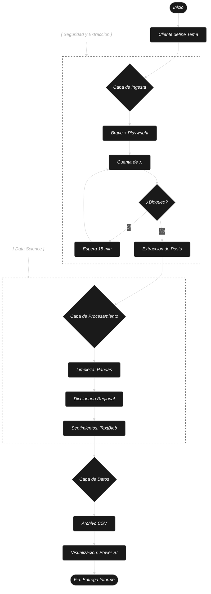
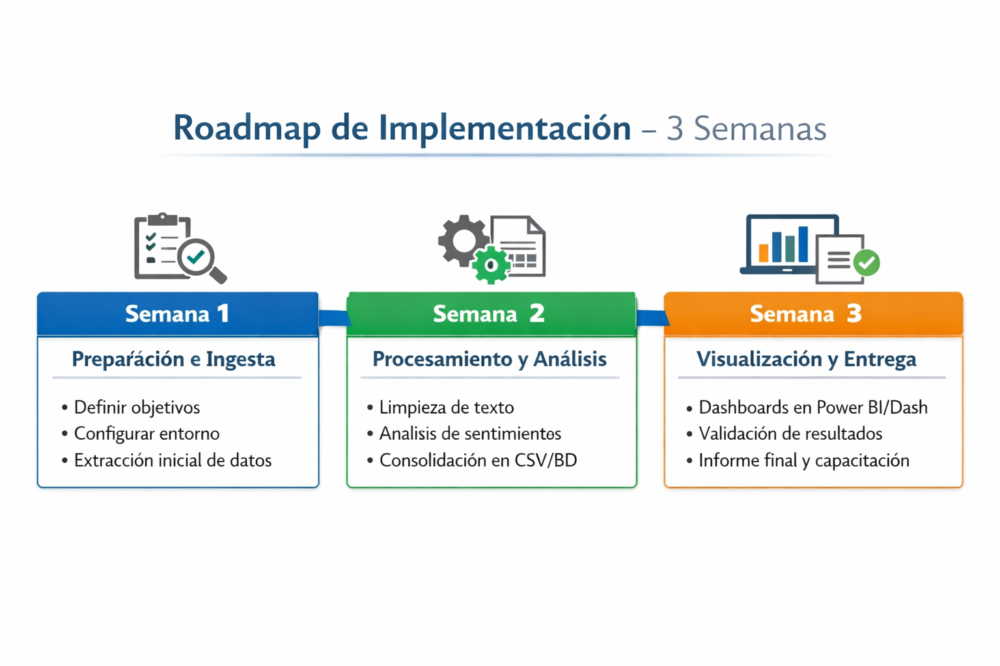

# TP1_Arquitectura_de_Soluciones

## Equipo: 
* Marlene Karen Jiménez Cabrera
* Juan Manuel Resquin
* Alejandro Vergara

# Proyecto de Arquitectura de Soluciones: Análisis de Sentimientos en X (Twitter)

### La arquitectura diseñada para este proyecto responde a la necesidad de transformar grandes volúmenes de datos no estructurados provenientes de redes sociales en información estratégica accionable. Se ha estructurado bajo un modelo de Capas de Servicio, lo que garantiza que el sistema sea modular, escalable.

# 1. Identificación de Requerimientos y Recursos

## Recursos Humanos y Físicos
* La solución está diseñada para ser ejecutada por una persona con una computadora estándar. No requiere una infraestructura de gran escala.

* Se aclara que, si bien el desarrollo requiere un perfil de Data Science, la operación final y el consumo de información están diseñados para ser autogestionados por un usuario final a través de la interfaz visual.

[Mockup del Prototipo](https://cot-maroon-75789898.figma.site/)

## Recursos de Software

**Navegador Brave:** 

Seleccionado como motor de renderizado para la automatización debido a su gestión eficiente de recursos y capacidad para manejar la huella digital (fingerprinting), lo que reduce la tasa de bloqueos.

**Cuenta de Servicio en X:**

Se utiliza una cuenta específica para la fase de ingesta, gestionada bajo parámetros de comportamiento humano para evitar la detección.

**Visual Studio Code:**

Como entorno de desarrollo, aprovechando extensiones como Markdown para la documentación.

**Librerías de Python:**

Pandas (manejo de datos), Asyncio (programación asíncrona), sys y os (sistema), Playwright (automatización), random y re (utilidades), Matplotlib (gráficos), TextBlob (análisis de sentimientos y con el uso de un diccionario ajustado al vocabulario regional)

**Visualización:**

Power BI para el análisis final de KPIs.

## Alcance Temporal
La herramienta debe permitir una extracción semanal con una ventana retrospectiva de hasta un mes, asegurando que los datos sean vigentes para el análisis de tendencias.

# 2. Arquitectura de la Solución (Esqueleto Base)

La arquitectura se divide en capas funcionales para garantizar que sea aplicable a cualquier tema de búsqueda:

**Capa de Ingesta (Lectura de X):**

Implementación de una conexión vía un Script de automatización de búsqueda. El sistema recibirá un **"URL del Post"** como parámetro de entrada, permitiendo la reutilización total del código.

**Capa de Procesamiento (Estimación de Sentimientos):**

Uso de librerías de Procesamiento de Lenguaje Natural (NLP) para clasificar los posts en categorías (Positivo, Negativo, Neutro).

También se utilizara en este proceso un diccionario ajustado al vocabulario regional, para lograr una mejor categorización.

**Capa de Datos:** 

Los datos se estructuran en formato CSV, lo que facilita su portabilidad y lectura para otras herramientas.

**Capa de Visualización (Graficador):**

Integración con herramientas de análisis como PowerBI o dashboards generados automáticamente para que el usuario final visualice los resultados sin manipular código. 

# 3. Modelado de Procesos (Diagramas de Flujo)

Para asegurar que la solución sea comprendida en todas las situaciones posibles, el flujo de trabajo debe seguir esta lógica:

**Inicio:** El usuario ingresa el "Tema" y el rango de fechas (máximo 30 días).

**Extracción:** El sistema valida las credenciales y realiza la petición de posts.

**Limpieza:** Se eliminan caracteres especiales y se normaliza el texto.

**Análisis:** Se asigna un puntaje de sentimiento a cada registro.

**Persistencia:** Se guardan los resultados en el formato CSV.

**Salida:** Se actualiza el gráfico o reporte final en Power BI.

# 4. Seguridad y Aspectos Legales

**Este apartado es crítico para cumplir con las normas de seguridad y ética en el manejo de datos:**

**Normas de Seguridad Operativa:** El uso de Brave y la rotación de tiempos de espera en Playwright no son solo elecciones técnicas, sino medidas de seguridad para proteger la integridad de la cuenta de extracción y asegurar la continuidad del servicio.

**Seguridad de acceso:** Se utilizará el navegador Brave para la extracción de datos mediante técnicas de scraping controlado, ya que permite simular la interacción de un usuario real, reducir bloqueos automatizados y mejorar la estabilidad del proceso de recolección. Además, su uso facilita la ejecución de herramientas de automatización como Playwright en un entorno seguro.

**Advertencias legales:** La cuenta utilizada para la extracción de datos podría ser detectada por la plataforma X y suspendida por un período indeterminado, que podría ser desde 15 minutos como mínimo. 

**Términos de servicio:** El uso de la herramienta debe respetar los límites de consultas establecidos para evitar la detección por parte de la plataforma X. Se recomienda no hacer varias veces la extracción de un mismo post, para no levantar sospechas.
Se establece un protocolo de Extracción Ética, limitando la frecuencia de consultas para no afectar la estabilidad de la plataforma de origen y respetando la privacidad mediante la anonimización automática de los usuarios analizados.

**Privacidad:** No se deben almacenar datos personales identificables de los autores de las publicaciones.

**Propiedad intelectual:** Los datos extraídos deben utilizarse únicamente con fines de análisis general, evitando su redistribución masiva que pueda infringir derechos de autor.

# 5. Observaciones de Implementación

**Modelo de Entrega (Informes):** 

Es importante destacar que el cliente no recibe un script para ejecutar, sino un servicio de inteligencia. La arquitectura está diseñada para que el especialista procese la solicitud del cliente sobre cualquier tema, aplique los filtros regionales y entregue un informe cerrado o un acceso al dashboard de Power BI.

**Ventaja Competitiva:** 

Esta solución supera las limitaciones de la API oficial de X al permitir:

* Filtros personalizados de limpieza de ruido.

* Análisis semántico con contexto cultural (diccionario regional).

* Visualización lista para la toma de decisiones sin que el cliente toque una sola línea de código.

**Estandarización:** Se ratifica el uso de CSV como el "contrato de datos" estándar. Esto asegura que la solución sea compatible con cualquier otra herramienta de visualización en el futuro.

**Herramienta para No Especialistas:** Se debe entregar un script ejecutable o un archivo de configuración simple donde el usuario solo cambie el nombre de **"URL del Post"** entre comillas.

**Mantenibilidad:** Al utilizar una estructura basada en clases y diagramas claros, cualquier cambio futuro puede gestionarse mediante control de versiones y solo requerirá modificar la clase de “Ingesta”, sin afectar el resto del sistema.

